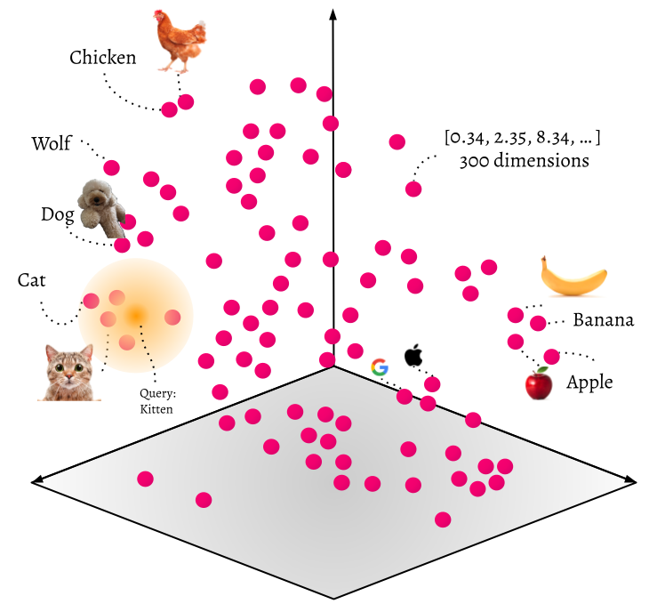

# AI Projects Overview

This repository contains various projects built with **LangChain** and **LangGraph**. These frameworks enable the creation of robust, modular, and flexible AI applications.

---

## Visual Overview

### LangChain Workflow


### LangGraph Nodes


---

## Basic Terminology

### LangChain
LangChain is a framework designed to simplify the development of applications using large language models (LLMs). It abstracts and connects various components such as models, chains, agents, and memory to handle text-based workflows efficiently.

#### Key Concepts:
- **Chains**: A sequence of processing steps to solve a task.
- **Memory**: State that persists throughout a conversation or task execution.
- **Agents**: Dynamic decision-makers that invoke different tools or chains based on the problem.
- **Tools**: External systems or APIs that agents use to perform tasks outside the model itself, such as:
    - **Web Search APIs**: Gather information from the web.
    - **DALL-E Image Generator**: Generate images based on prompts.
    - **And etc.**

### LangGraph
LangGraph builds on LangChain to introduce a more graphical approach to building workflows. It focuses on defining nodes (steps) and their connections, allowing users to visualize and manage the data flow more easily.

#### Key Concepts:
- **Nodes**: Individual steps or operations within a workflow.
- **Edges**: The connections that dictate the flow of data between nodes.

---

## Additional Terminology

### Vector Stores
**Vector Stores** (like memory-based vector stores) are a key component for handling embeddings and large-scale data. Vectors represent data points in a high-dimensional space, commonly used for tasks like document retrieval and similarity search.

* Vector embeddings are numerical representations of data that capture essential features and relationships within the data.
* So Information is converted into vector embeddings — or simply “vectors” — which are then used for predictions, interpretation, comparison, and other cognitive functions.

#### How do vector databases work ?


* Vector databases transform data, such as text, into vectors using embedding algorithms, which are then stored. For text, embeddings capture the semantic meaning of words, phrases, sentences, or even entire documents. These embeddings are often produced by deep learning models like Word2Vec, FastText, or BERT.
* When a user submits a query, it is also converted into a vector using the same embedding algorithm. The query vector is then compared to the stored vectors to find the closest matches. Essentially, the database is being queried for vectors that are similar to the query's vector embedding.
* The key feature of vector databases is their ability to perform "similarity searches." Instead of traditional keyword-based searches that look for exact matches, similarity searches focus on finding vectors that are "close" to the query vector in a high-dimensional space. This closeness is usually determined by metrics such as cosine similarity or Euclidean distance.

#### How Do Vector Databases Store Data?



Vector databases save data by turning it into numbers called vectors. These numbers represent things like items or documents in a way that shows their features. If two things are similar, their numbers will be close to each other. If they are different, their numbers will be further apart. This makes it easy for the database to find things that are alike.

#### Key concepts:
- **Embeddings**: Numerical representations of text, images, or other data types, stored as vectors.
  > Embedding is like giving each item, whether it's a word, image, or something else, a unique code that captures its meaning or essence. This code helps computers understand and compare these items in a more efficient and meaningful way. Think of it as turning a complicated book into a short summary that still captures the main points.

  
- **Similarity Search**: Matching vectors to find relevant data, often used in document retrieval or search tasks.

#### Vector Store Comparison with Traditional Databases


---

## Example Project Structure Template

This is my proposed project structure for organizing AI-based projects using LangChain and LangGraph. It is modular and designed to be flexible, allowing it to be extended for workflows involving text generation, image creation, critique, and publishing decisions.

```perl
src/
├── cli/
│   └── commands/
│       ├── command.handler.ts      # Command handler logic for CLI interactions
│       └── ...
│
├── conditions/
│   ├── should-continue.condition.ts      # Logic to determine if the workflow should continue
│   └── ...
│
├── constants/
│   ├── prompt-terminology.constant.ts  # Constants for prompt terminology used across agents and nodes
│   └── ...
│
├── nodes/
│   ├── context-preparation/           # Prepares the context for the post generation
│   └── ...
│
├── state/
│   ├── models/                        # Data models and states
│   └── agent.state.ts                 # Manages agent states in the workflow
│
└── utils/ # Utility functions for various workflow operations
```

### Explanation:
* **cli/commands**: Handles command-line interactions, typically for setting up or managing workflows.
* **conditions**: Contains files defining the conditions that influence decisions, such as whether to continue rewriting or publish the post.
* **constants**: Stores shared constants, such as prompt terminology, across the project.
* **nodes**: The core processing logic, with each node handling a specific aspect of the workflow:
* **state**: Handles the state management, such as storing agent states and arguments.
* **utils**: Utility functions to support the workflow operations, making the project more modular and reusable.

This proposed structure can be used as a starting point for any AI-driven project involving workflows, decision-making, and content generation.

## List of Projects

- [Social Media Post Generator](./social-media-post-generator): Automates the creation of LinkedIn posts using AI for text generation, critique, and image creation.
- *More projects coming soon!*
