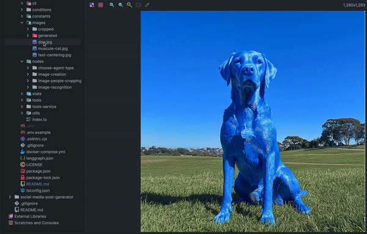

# Image Agents Project

This project is designed for handling image-related workflows using LangChain and LangGraph. The project includes functionalities for image recognition, image creation, and people-cropping, all powered by a set of nodes and workflows. Additionally, it utilizes the `tools-service`, which provides backend tools for image captioning and processing.

## Features
- **Image Recognition**: Identify and recognize objects or scenes in images.
- **Image Creation**: Generate images based on user interactions.
- **People Cropping**: Crop the photo around people, adjusting the size of the image to match the contour where people are located, so only the people remain.
- **Dynamic Workflow**: A state graph defines conditional workflows that interact with users and process images accordingly.

## Project Structure

```
image-agents/
├── src/                                   # Source code
│   ├── cli/                               # Command-line utilities
│   ├── conditions/                        # Conditions for workflow decisions
│   ├── constants/                         # Project constants
│   ├── images/                            # Image assets
│   │   ├── cropped/                       # Cropped images
│   │   └── generated/                     # Generated images
│   ├── nodes/                             # Workflow nodes
│   │   ├── choose-agent-type/             # Node for choosing the type of agent
│   │   ├── image-creation/                # Nodes for image creation process
│   │   ├── image-people-cropping/         # Nodes for people cropping process
│   │   └── image-recognition/             # Nodes for image recognition process
│   ├── state/                             # State management for graph arguments
│   ├── tools/                             # General tools and utilities
│   ├── tools-service/                     # Dockerized tools for image captioning and processing
│   ├── utils/                             # Utility functions like error handling and logging
│   └── index.ts                           # Main entry point for running the workflow
├── .env.example                           # Example environment configuration
├── docker-compose.yml                     # Docker Compose configuration for services
├── langgraph.json                         # LangGraph workflow configuration
├── package.json                           # Node.js project metadata and dependencies
```

## Workflows

The image-related workflows are defined using LangGraph's state machine. The main workflows include:

1. **Image Recognition**:
   - Interacts with the user to gather image input.
   - Processes the image to identify objects or scenes.



2. **Image Creation**:
   - Allows users to interactively create images.
   - Uses image generation tools to generate images based on user input.

3. **People Cropping**:
   - Focuses on cropping the photo around people. The algorithm calculates the contour where the people are located and crops everything outside that contour, leaving only the people in the final image.
   - Provides an interactive interface for users to select and crop images.

## Example Workflow

The workflows are orchestrated by the state graph defined in `index.ts`. A typical workflow includes:

1. **Start** by choosing the agent type.
2. **Image Recognition**:
   - If the agent type is image recognition, start user interaction for recognition.
   - Process the image and recognize objects or scenes.
3. **Image Creation**:
   - If the agent type is image creation, start user interaction for image generation.
   - Create and process the image based on user input.
4. **People Cropping**:
   - If the agent type is people cropping, start user interaction for cropping.
   - Detect and crop the photo around people, adjusting the size of the image based on the contour where people are located.
5. **End** the workflow after the process is complete.

## Setup Instructions

1. **Install Dependencies**:
   Run the following command to install Node.js dependencies:

   ```bash
   npm install
   ```

2. **Run Docker Services**:
   The `tools-service` is dockerized and provides backend tools for the workflows. To start the Docker services, use:

   ```bash
   docker-compose up --build
   ```

3. **Run the Workflow**:
   Once the environment is set up, you can start the workflow by running:

   ```bash
   npm run start
   ```

This will invoke the defined state graph and handle the image workflows.

## License

This project is licensed under the MIT License. See the [LICENSE](LICENSE) file for more details.
