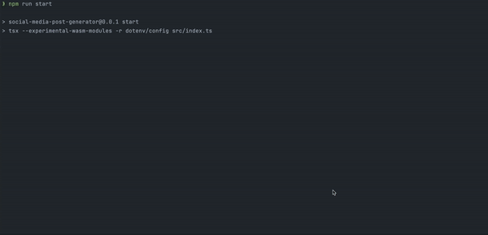

# Social Media Post Generator with AI Agents

This project automates the generation of social media posts (at the moment ONLY for LinkedIn), including both text and images, using AI-powered agents. It is built using [LangChain](https://github.com/hwchase17/langchain) and [LangGraph](https://github.com/langgraph/langgraph) and written in **TypeScript** for a modular and type-safe development environment.



## Features

- **Text Generation**: Automatically generates text for social media posts based on provided context.
- **Image Generation**: Uses a DALL-E model to generate images from AI-generated prompts.
- **Text Post Critique and Rewriting**: Includes AI agents to critique and rewrite the generated text post for quality improvements.
- **Image Prompt Generation**: After the text post passes critique, an AI agent automatically generates a DALL-E prompt based on the post context to ensure the image reflects the content.
- **Image Creation**: Based on the generated DALL-E prompt, the image creation node produces the final image for the social media post.
- **User Decision Node**: A final decision node allows users to review the post and image. As part of this step, the user can either approve, regenerate the post or image, or discard the content before publishing to LinkedIn.

## How It Works

1. **Text and Image Generation**: 
   - The system begins by generating both text and an image for the social media post based on the context provided by the user.
   
2. **Post Critique and Rewriting**:
   - After generating the text, an AI agent critiques it and optionally rewrites it to enhance clarity, tone, and engagement.
   
3. **Image Prompt Generation**:
   - Once the text post passes the critique stage, the system automatically generates a DALL-E prompt based on the post context. This prompt ensures the image is relevant to the content.

4. **Image Creation**:
   - After generating the prompt, the image creation node uses this prompt to produce the final image for the social media post.

5. **Publishing Decision**:
   - In the final step, the user reviews both the text and image. The user can choose to:
     - Approve and publish the content to social media.
     - Regenerate either the text or the image if unsatisfied.
     - Discard the content and exit the process.

## Installation

1. Clone this repository:

    ```bash
    git clone https://github.com/Dsazz/langgraph-playground.git
    cd langgraph-playground/social-media-post-generator
    ```

2. Install the required dependencies:

    ```bash
    npm install
    ```

3. Set up your `.env` file:
    ```bash
    cp .env.example .env
    ```

## Usage

1. **Start the Text and Image Generation Process**:

   ```bash
   npm run start
   ```

2. **Post Critique and Image Generation**:
   - The AI agent will critique the text post. Once the critique is successful, the system automatically generates a DALL-E prompt and creates the corresponding image.

3. **Publishing Decision**:
   - After reviewing both the post and image, the user can choose to:
     - Publish the content to social media.
     - Regenerate the post or image.
     - Discard the content.

## Contributing

Feel free to submit issues or pull requests for any improvements or bug fixes.

## License

This project is licensed under the MIT License - see the [LICENSE](LICENSE) file for details.
